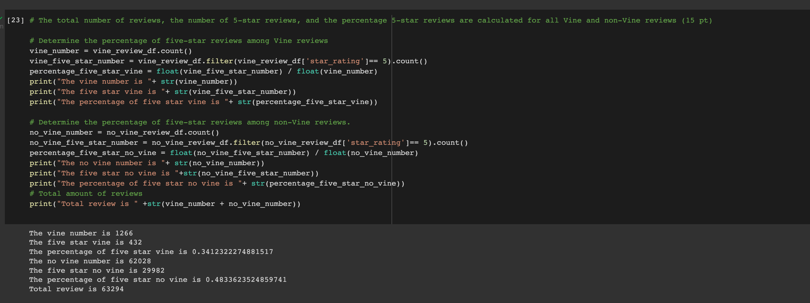

# Amazon_Vine_Analysis

## Purpose
Analyzing Amazon reviews written by members of the paid Amazon Vine program
## result

## Summary
After reviewing the results comparing the Vine vs. No Vine reviews, there is bias-free for reviews in the Vine program. 
To get statistically significant quantity, trend, or deviation , the results could be further examined, such us  the distribution of the fivw star rates of Vine and non-Vine reviews.

